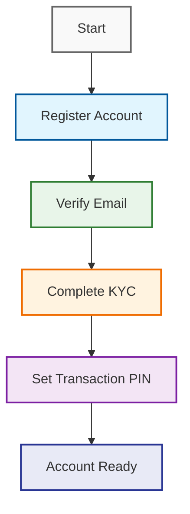

# 📱 Fintech Platform API Documentation

## 📑 Tabl## 🌐 API Endpoints Reference

### 👤 User Profile & Verification Contents
1. [🔐 Authentication & Registration](#authentication--registration)
2. [👤 User Profile Management](#user-profile-management)
3. [📋 KYC (Know Your Customer)](#kyc-know-your-customer)
4. [🔒 Security & Transaction PIN](#security--transaction-pin)
5. [⚙️ Admin Endpoints](#admin-endpoints)
6. [📚 Models Reference](#models-reference)

## 🔐 Authentication & Registration

### 🔄 Registration Flow


### 📡 System Events (`signals.py`):
- **User Profile Creation:**
  - When a new user is created, a `UserProfile` is automatically created via a `post_save` signal.
- **Custom Deletion Signals:**
  - `pre_user_delete`: Emitted before a user is deleted.
  - `post_user_delete`: Emitted after a user is deleted.
- **Receivers:**
  - **Audit Logging:** Logs user deletion events before and after deletion.
  - **Session Cleanup:** Deletes all `UserSession` objects related to a user after deletion.

### Automated User Deletion Task (`tasks.py`):
- **Function:** `delete_expired_unverified_users`
  - Finds all unverified users whose OTP has expired.
  - Emits `pre_user_delete` and `post_user_delete` signals for each user.
  - Deletes the user and their related sessions.
  - Logs actions and errors.
  - Notifies admins via email with a summary of deletions and any errors.

### AppConfig (`apps.py`):
- Registers signals on app startup.
- Schedules the `delete_expired_unverified_users` task to run every 10 minutes (when using the development server).

---

## 2. URL List and Explanations (`urls.py`)


### User Profile & Verification
- **`GET /profile/`**
  - _Description:_ Get the current user's profile.
- **`PUT /profile/`**
  - _Description:_ Update the current user's profile.
  - _Body:_ `{ "phone": "08012345678", "notify_email": true, ... }`

- **`POST /request-verification/`**
  - _Description:_ Request verification for the current user (e.g., send OTP or verification link).

- **`POST /verify/`**
  - _Description:_ Verify the user, typically via OTP or a verification link.
  - _Body:_ `{ "otp_code": "123456" }`

### Tier Upgrade
- **`GET /tier-upgrade/requirements/`**
  - _Description:_ Get the requirements for upgrading the user's tier.
- **`POST /tier-upgrade/request/`**
  - _Description:_ Request a tier upgrade for the user.
- **`GET /tier-upgrade/eligibility/`**
  - _Description:_ Check if the user is eligible for a tier upgrade.

### Admin Dashboards & Reports
- **`GET /admin/dashboard/`**
  - _Description:_ Main dashboard for admin users.
- **`GET /admin/compliance-report/`**
  - _Description:_ View compliance reports (admin only).
- **`GET /admin/user-analytics/`**
  - _Description:_ View analytics about users (admin only).
- **`GET /admin/system-monitoring/`**
  - _Description:_ System monitoring dashboard for admins.

### Admin API Endpoints
- **`GET /admin/api/dashboard-data/`**
  - _Description:_ API endpoint providing data for the admin dashboard.
- **`GET /admin/api/user-export/`**
  - _Description:_ API endpoint to export user data (admin only).

### 📋 KYC (Know Your Customer)

#### Get All KYC Profiles
**`GET /kyc-profiles/`**

Retrieve a list of all KYC profiles (Admin only).

**Response:** `200 OK`
```json
{
    "count": 10,
    "next": "api/kyc-profiles/?page=2",
    "previous": null,
    "results": [
        {
            "id": "uuid",
            "user": "user_id",
            "bvn": "12345678901",
            "kyc_level": "tier_1",
            "is_approved": true
        }
    ]
}
```

#### Create KYC Profile
**`POST /kyc-profiles/`**

Submit a new KYC profile for verification.

**Request Body:**
```json
{
    "bvn": "12345678901",
    "nin": "12345678901",
    "date_of_birth": "1990-01-01",
    "address": "123 Main Street",
    "state": "Lagos"
}
- **`GET /kyc-profiles/{id}/`**
  - _Description:_ Retrieve a specific KYC profile.
- **`PUT /kyc-profiles/{id}/`**
  - _Description:_ Update a specific KYC profile.
  - _Body:_ `{ "address": "123 Main St", ... }`
- **`DELETE /kyc-profiles/{id}/`**
  - _Description:_ Delete a specific KYC profile.

- **`POST /kyc/validate-bvn/`**
  - _Description:_ Validate a user's BVN (Bank Verification Number).
  - _Body:_ `{ "bvn": "12345678901" }`

- **`POST /kyc/validate-nin/`**
  - _Description:_ Validate a user's NIN (National Identification Number).
  - _Body:_ `{ "nin": "12345678901" }`

### 📝 Account Registration & Verification

#### Register New Account
**`POST /accounts/register/`**

Create a new user account in the system.

**Request Body:**
```json
{
    "username": "user1",
    "email": "user@example.com",
    "password": "pass1234"
}
```

**Response:** `201 Created`
```json
{
    "id": "uuid",
    "username": "user1",
    "email": "user@example.com",
    "message": "Registration successful. Please verify your email."
}
```

#### Resume Registration
**`POST /accounts/resume-registration/`**

Continue a previously started registration process.

**Request Body:**
```json
{
    "email": "user@example.com"
}
```

#### Verify OTP
**`POST /accounts/verify-otp/`**

Verify the One-Time Password (OTP) sent to user.

**Request Body:**
```json
{
    "otp_code": "123456"
}
```
- **`POST /accounts/kyc-input/`**
  - _Description:_ Input KYC (Know Your Customer) information.
  - _Body:_ `{ "bvn": "12345678901", "nin": "12345678901", ... }`
- **`POST /accounts/verify-email/`**
  - _Description:_ Verify a user's email via a verification link.
  - _Body:_ `{ "token": "abcdefg" }`

### Transaction PIN Management
- **`POST /transaction-pin/set/`**
  - _Description:_ Set the user's transaction PIN (only if not already set).
  - _Body:_ `{ "pin": "1234" }`
- **`POST /transaction-pin/change/`**
  - _Description:_ Change/update the user's transaction PIN (requires old PIN for verification).
  - _Body:_ `{ "old_pin": "1234", "new_pin": "5678" }`

---

## 3. Summary

- The app provides robust user management, KYC, and admin analytics endpoints.
- Automated cleanup and auditing are handled via Django signals and scheduled tasks.
- All critical user and admin actions are exposed via clear, RESTful URLs.

---

## 📚 Model Requirements

### 👤 UserProfile

Represents additional user information and settings.

```python
class UserProfile(models.Model):
    """Stores additional user information and settings"""
    
    user = models.OneToOneField(User, on_delete=models.CASCADE)
    phone = PhoneNumberField(unique=True, null=True)
    is_verified = models.BooleanField(default=False)
    otp_code = models.CharField(max_length=6, null=True)
- **otp_expiry**: DateTimeField (optional, for OTP expiry)
- **notify_email**: Boolean (default True)
- **notify_sms**: Boolean (default False)
- **notify_push**: Boolean (default False)
- **notify_in_app**: Boolean (default True)
- **fcm_token**: CharField (optional, for push notifications)
- **transaction_pin**: CharField (hashed, optional)

### AuditLog
- **timestamp**: DateTime (auto)
- **user**: ForeignKey to User (optional)
- **action**: CharField (required, choices)
- **description**: TextField (required)
- **ip_address**: GenericIPAddressField (optional)
- **user_agent**: TextField (optional)
- **severity**: CharField (required, choices)
- **content_type**: ForeignKey to ContentType (optional)
- **object_id**: PositiveIntegerField (optional)
- **content_object**: GenericForeignKey (optional)
- **metadata**: JSONField (optional)

### SecurityAlert
- **timestamp**: DateTime (auto)
- **alert_type**: CharField (required, choices)
- **severity**: CharField (required, choices)
- **status**: CharField (required, choices, default 'open')
- **title**: CharField (required)
- **description**: TextField (required)
- **affected_user**: ForeignKey to User (optional)
- **ip_address**: GenericIPAddressField (optional)
- **resolved_at**: DateTimeField (optional)
- **resolved_by**: ForeignKey to User (optional)
- **notes**: TextField (optional)

### UserSession
- **user**: ForeignKey to User (required)
- **session_key**: CharField (unique, required)
- **ip_address**: GenericIPAddressField (required)
- **user_agent**: TextField (required)
- **created_at**: DateTime (auto)
- **last_activity**: DateTime (auto)
- **is_active**: Boolean (default True)

### KYCProfile
- **id**: UUID (primary key, auto)
- **user**: OneToOneField to User (required)
- **bvn**: CharField (unique, optional)
- **nin**: CharField (unique, optional)
- **date_of_birth**: DateField (required)
- **state**: CharField (optional)
- **gender**: CharField (choices, optional)
- **lga**: CharField (optional)
- **area**: CharField (optional)
- **address**: TextField (required)
- **telephone_number**: CharField (optional)
- **passport_photo**: ImageField (required)
- **selfie**: ImageField (required)
- **id_document**: FileField (required)
- **kyc_level**: CharField (choices, required)
- **is_approved**: Boolean (default False)
- **approved_by**: ForeignKey to User (optional)
- **approved_at**: DateTimeField (optional)
- **rejection_reason**: TextField (optional)
- **last_upgrade_check**: DateTimeField (optional)
- **upgrade_eligibility_score**: IntegerField (default 0)
- **upgrade_requested**: Boolean (default False)
- **upgrade_request_date**: DateTimeField (optional)
- **govt_id_type**: CharField (choices, optional)
- **govt_id_document**: FileField (optional)
- **proof_of_address**: FileField (optional)
- **created_at**: DateTime (auto)
- **updated_at**: DateTime (auto)

---

## 5. Bank App Model Requirements

### Wallet
- **user**: OneToOneField to User (required)
- **account_number**: CharField (unique, required)
- **alternative_account_number**: CharField (unique, required)
- **balance**: MoneyField (required, default 0, currency NGN)
- **currency**: CharField (default 'NGN')
- **created_at**: DateTime (auto)
- **updated_at**: DateTime (auto)

### 💳 Transaction

Represents financial transactions in the system.

```python
class Transaction(models.Model):
    """
    Stores all financial transactions including transfers,
    deposits, and bill payments.
    """
    
    wallet = models.ForeignKey('Wallet', on_delete=models.PROTECT)
    receiver = models.ForeignKey('Wallet', null=True, related_name='received_transactions')
    reference = models.CharField(max_length=50, unique=True)
    amount = MoneyField(max_digits=19, decimal_places=2, default_currency='NGN')
- **type**: CharField (choices: credit/debit, required)
- **channel**: CharField (choices: transfer/deposit/bill, required)
- **description**: TextField (required)
- **timestamp**: DateTime (auto)
- **status**: CharField (choices: success/pending/failed, required)
- **balance_after**: MoneyField (optional)
- **parent**: ForeignKey to self (optional, for reversals)
- **currency**: CharField (default 'NGN')
- **content_type**: ForeignKey to ContentType (optional)
- **object_id**: PositiveIntegerField (optional)
- **related_object**: GenericForeignKey (optional)
- **metadata**: JSONField (optional)

### BankTransfer
- **user**: ForeignKey to User (required)
- **bank_name**: CharField (required)
- **bank_code**: CharField (optional)
- **account_number**: CharField (required)
- **amount**: MoneyField (required)
- **fee**: MoneyField (default 0)
- **vat**: MoneyField (default 0)
- **levy**: MoneyField (default 0)
- **reference**: CharField (unique, required)
- **status**: CharField (choices: pending/completed/failed, default pending)
- **transfer_type**: CharField (choices: intra/inter, default inter)
- **description**: CharField (optional)
- **failure_reason**: TextField (optional)
- **requires_approval**: Boolean (default False)
- **approved_by**: ForeignKey to User (optional)
- **approved_at**: DateTimeField (optional)
- **created_at**: DateTime (auto)
- **updated_at**: DateTime (auto)
- **nibss_reference**: CharField (optional)

### BillPayment
- **user**: ForeignKey to User (required)
- **service_type**: CharField (required)
- **account_or_meter**: CharField (required)
- **amount**: MoneyField (required)
- **status**: CharField (choices: success/failed/pending, required)
- **reference**: CharField (unique, required)
- **timestamp**: DateTime (auto)

### VirtualCard
- **user**: ForeignKey to User (required)
- **card_number**: CharField (required)
- **expiry**: CharField (required)
- **cvv**: CharField (required)
- **provider**: CharField (required)
- **status**: CharField (choices: active/blocked, required)
- **issued_at**: DateTime (auto)

### Bank
- **name**: CharField (required)
- **code**: CharField (required)
- **slug**: SlugField (required)
- **ussd**: CharField (optional)
- **logo**: URLField (optional)

### VATCharge
- **rate**: DecimalField (default 0.075)
- **active**: Boolean (default True)
- **updated_at**: DateTime (auto)

### CBNVATCharge
- **transfer**: OneToOneField to BankTransfer (required)
- **vat_amount**: MoneyField (required)
- **vat_rate**: DecimalField (required)
- **created_at**: DateTime (auto)

### TransferChargeControl
- **levy_active**: Boolean (default True)
- **vat_active**: Boolean (default True)
- **fee_active**: Boolean (default True)
- **updated_at**: DateTime (auto)

### StaffRole
- **name**: CharField (choices, unique, required)
- **level**: IntegerField (required)
- **description**: TextField (required)
- **max_transaction_approval**: MoneyField (default 0)
- **can_approve_kyc**: Boolean (default False)
- **can_manage_staff**: Boolean (default False)
- **can_view_reports**: Boolean (default False)
- **can_override_transactions**: Boolean (default False)
- **can_handle_escalations**: Boolean (default False)
- **created_at**: DateTime (auto)
- **updated_at**: DateTime (auto)

### StaffProfile
- **user**: OneToOneField to User (required)
- **role**: ForeignKey to StaffRole (required)
- **employee_id**: CharField (unique, required)
- **branch**: CharField (optional)
- **department**: CharField (optional)
- **supervisor**: ForeignKey to self (optional)
- **is_active**: Boolean (default True)
- **hire_date**: DateField (required)
- **last_review_date**: DateField (optional)
- **created_at**: DateTime (auto)
- **updated_at**: DateTime (auto)

### TransactionApproval
- **transaction**: ForeignKey to Transaction (required)
- **requested_by**: ForeignKey to StaffProfile (required)
- **approved_by**: ForeignKey to StaffProfile (optional)
- **status**: CharField (choices: pending/approved/rejected/escalated, default pending)
- **reason**: TextField (optional)
- **escalation_reason**: TextField (optional)
- **escalated_to**: ForeignKey to StaffProfile (optional)
- **created_at**: DateTime (auto)
- **updated_at**: DateTime (auto)

### CustomerEscalation
- **customer**: ForeignKey to User (required)
- **created_by**: ForeignKey to StaffProfile (required)
- **assigned_to**: ForeignKey to StaffProfile (optional)
- **priority**: CharField (choices: low/medium/high/urgent, default medium)
- **status**: CharField (choices: open/in_progress/resolved/closed, default open)
- **subject**: CharField (required)
- **description**: TextField (required)
- **resolution**: TextField (optional)
- **created_at**: DateTime (auto)
- **updated_at**: DateTime (auto)
- **resolved_at**: DateTime (optional)

### StaffActivity
- **staff**: ForeignKey to StaffProfile (required)
- **activity_type**: CharField (choices, required)
- **description**: TextField (required)
- **related_object_id**: PositiveIntegerField (optional)
- **related_object_type**: ForeignKey to ContentType (optional)
- **related_object**: GenericForeignKey (optional)
- **timestamp**: DateTime (auto)

---

If you need more detailed documentation for any specific view, signal, or model, just check the relevant file or ask for more details! 